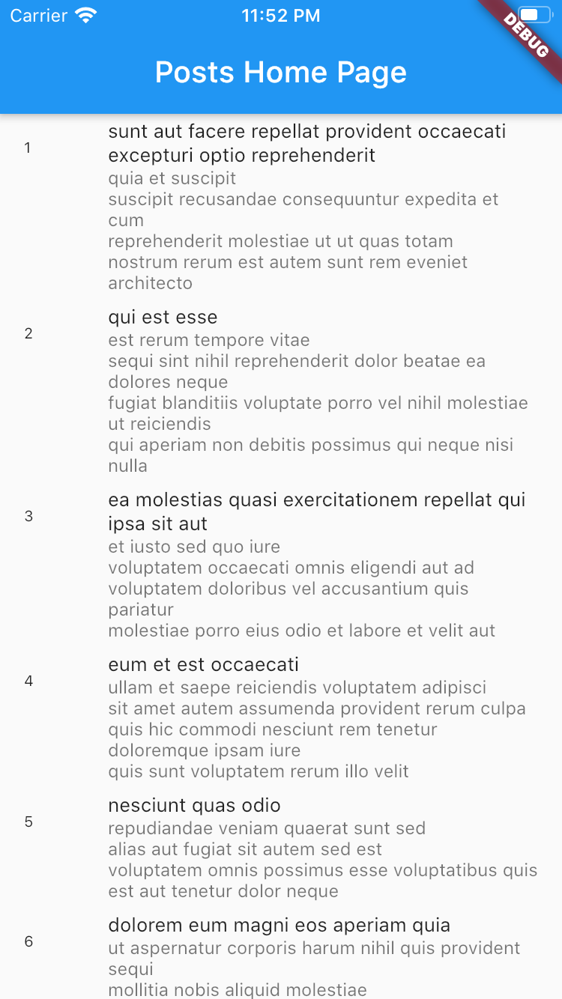
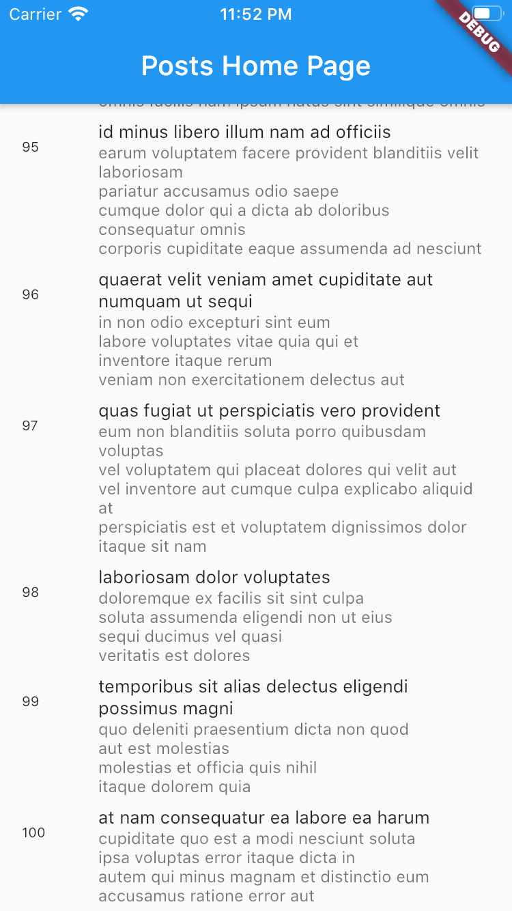

# Infinite Scrollable List

In this project, I have developed a flutter app which implements [bloc architecture](https://bloclibrary.dev/#/gettingstarted) to build an infinite scrollable list which loads data from REST API, [jsonPlaceholder](http://jsonplaceholder.typicode.com/). 

It followed following steps:

0. **Data Repository**: @TODO need to move from BLoC.
1. **Model**: Create `post.dart` model.
   1. This is simple PODO class with constructor and getter.
   2. uses equatable to compare two objects.
2. **Events**: Fetched; 
   1. Create abstract class, extend Equatable
   2. Create class for each of these events by extending abstract class.
3. **States**: Loading, Loaded, Error.
   1. Create abstract class, extend Equatable
   2. Create class for each of these events by extending abstract class.
   3. Define variables to be affected in each State.
   4. No logic here, only scaffolds, factories.
4. **Bloc**: A class which maps events and states classes.
   1. Provides initial state
   2. mapEventsToState
   3. Also, fetch posts using HTTP Client, this needs to be moved to repository, Step 0.
   4. Added, `debouce events` by transforming state before mapping, Overriding transform allows us to transform the Stream before mapEventToState is called. This allows for operations like distinct(), debounceTime(), etc... to be applied. Uses rxdart library.
5. **UI**: Then main class: 
   1. `main()` function calls the `App()` class.
   2. In `App()` widget, we use `BlocProvider` , provides instance of `PostBloc` to subtree.
   3. In `child: HomePage()`, we use `BlocBuilder` to return widget which updates on state change.
   4. Add `fetched` event to bloc. Whenever the user scrolls, we calculate how far away from the bottom of the page they are and if the distance is ≤ our _scrollThreshold we add a Fetch event in order to load more posts.
6. **Enhancements**: We made app more robust by adding:
   1. Logging: We deligated bloc `transitions` by creating our own `BlogDeligate`. This logs all state transition with  { current state, the event, and the next state } data.
   2. Optimization: We debounced the events. Overriding `transform` allows us to transform the Stream before mapEventToState is called. Using this we add `debounceTime` to `events`. This prevents spamming of API. 500ms is minimum time between each call.

**Screenshots**:
 | 
:-:|:-:
Initial State|All posts loaded

**App Structure:**
- lib
  - bloc
    - post_bloc.dart
    - post_event.dart
    - post_state.dart
    - simple_bloc_deligate.dart
  - models
    - post.dart
  - main.dart

This project was based on Bloc [tutorial](https://bloclibrary.dev/#/fluttertimertutorial?id=post-bloc) by @felangel.

Thank you!